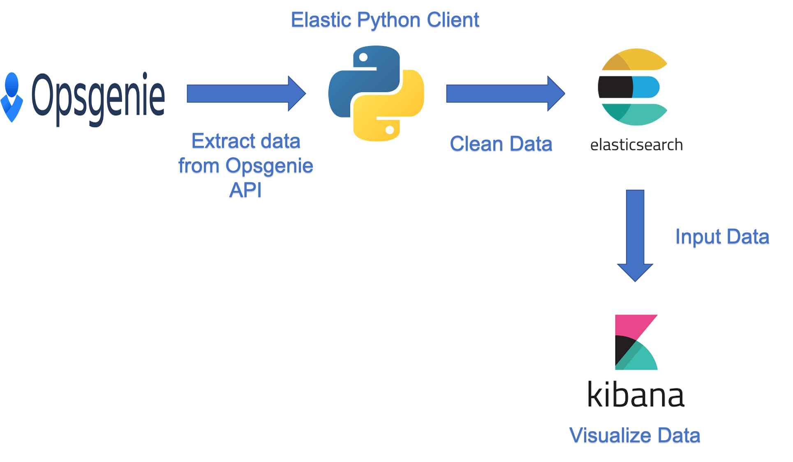
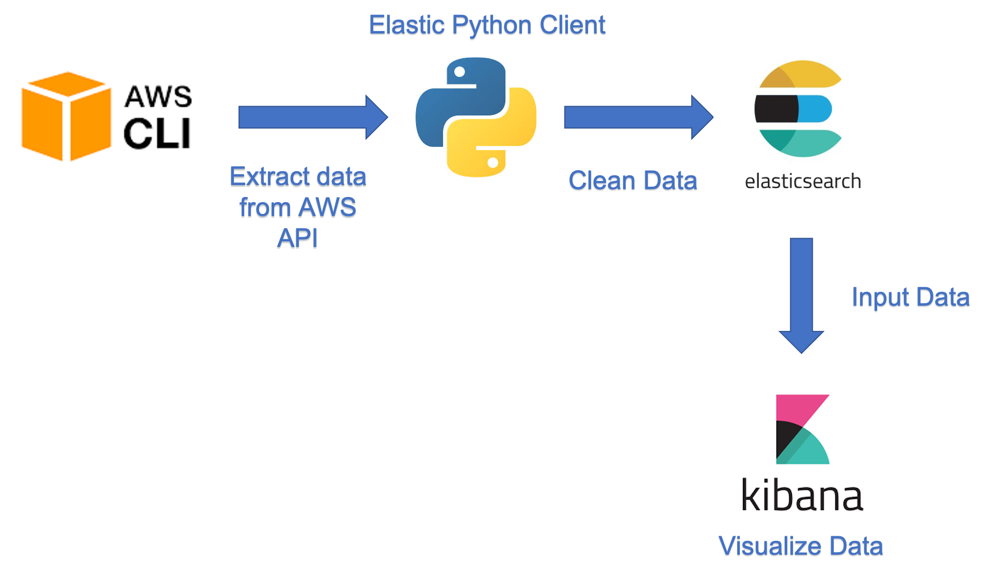

# Elasticsearch 串接不同的第三方 API (Via Python)
- [Opsgenie](./Opsgenie/README.md)
- [AWS](./AWS/README.md)
## Opsgenie Workflow

## AWS Workflow

# 前置
以 Mac 為例
## Install virtual environment
安裝 pipenv
```
pip3 install pipenv
```
## Build virtual environment
產生 Python 3 虛擬環境
```bash
pipenv --three  
```
> 若遇到 ValueError: unknown locale: UTF-8 這類錯誤資訊，表示系統需要設定 LANG 環境變數，如：

```
export LANG=en_US.UTF-8 // ~/.bashrc or ~/.zshrc
```
## Install Package
安裝套件，以 requests 為例
```bash
pipenv install requests
```
### Packages
- [awscli](https://docs.aws.amazon.com/cli/latest/userguide/install-cliv2-mac.html) **v2**
- elasticsearch
- pytz
- requests
## Run virtual environment
```bash
pipenv shell
```
## AWS Configuration
目前採用 Switch Role 的方式撈取多個 Role在雲上的資源及指標數據，可設置一把專用的 Key Switch 到各個 Role 的環境。
### 設置專用的 Key 
以 Mac 為例，執行下方指令設置 Admin 資訊
```bash
sudo vim ~/.aws/credentials
```
填入資訊
```
[Admin]
aws_access_key_id=<admin_aws_access_key_id>
aws_secret_access_key=<admin_aws_secret_access_key>
```
`<admin_aws_access_key_id>` 替換為 Admin 專用的 Access Key
`<admin_aws_secret_access_key>` 替換為  Switch 到各個 Role 專用的 Secret Key
### 設置Role
執行下方指令設置 Role 資訊
```
sudo vim ~/.aws/config
```
下方以單一個 Role 做範例設置，多個 Role 的情況下，採用此方法一個個新增 Role
```
[profile <role_name>]
region = ap-northeast-1
role_arn = arn:aws:iam::<role_id>:role/AdminRole
source_profile = Admin
```
`<role_name>` 為自訂的 Role 名稱
`<role_id>` 替換成該 role 的 Account ID
## To-Do list
### Opsgenie
- [x] Alert

### AWS Resource
- [x] EC2
- [x] RDS
- [x] Config
- [x] IAM
- [x] Route53
- [x] CloudTrail
- [x] GuardDuty
- [x] CloudFront
- [x] SQS
- [x] ACM
- [ ] VPC
- [ ] WAF
- [x] Billing (RightsizingRecommendations; Cost optimizing)
- [ ] Billing (估計會從 RD Team 那邊獲取資料)

### AWS Performance
- [x] EC2
- [x] EC2 Cloudwatch Agent
- [x] RDS
- [x] CloudFront
- [x] S3
- [x] Elasticsearch

### GCP Resource
- [ ] GCE
- [ ] Storage
- [ ] Billing
- [ ] VPC
- [ ] BigQuery
- [ ] CloudSQL

### GCP Performance
- [ ] GCE
- [ ] Storage
- [ ] VPC
- [ ] BigQuery
- [ ] CloudSQL


